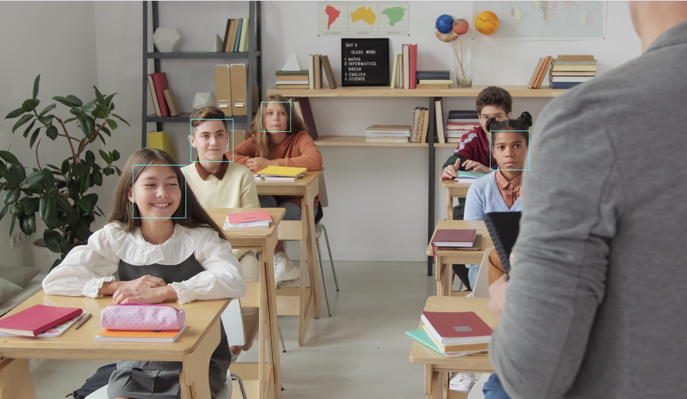

# Face Detection Using OpenCV

Welcome to the **Face Detection Using OpenCV** project! This project demonstrates real-time face detection using OpenCV's Haar Cascade Classifier.

## Table of Contents
- [Introduction](#introduction)
- [Features](#features)
- [Installation](#installation)
- [Usage](#usage)

## Introduction

This project captures video from a webcam and detects faces in real-time using OpenCV. The detected faces are highlighted with rectangles on the video stream.

### Screenshot


## Features

- Real-time face detection
- Simple and efficient code
- Uses OpenCV's pre-trained Haar Cascade Classifier

## Installation

1. Clone the repository:
    ```sh
    git clone https://github.com/your-username/face-detection-opencv.git
    cd face-detection-opencv
    ```

2. Install the required dependencies:
    ```sh
    pip install opencv-python
    ```

## Usage

1. Ensure you have a webcam connected to your computer.

2. Run the script:
    ```sh
    python face_detection.py
    ```

3. The webcam feed will open, and detected faces will be highlighted with rectangles.

4. Press `q` to close the video feed.

## Code

```python
import pathlib
import cv2

cascade_path = pathlib.Path(cv2.__file__).parent.absolute() / "data/haarcascade_frontalface_default.xml"
clf = cv2.CascadeClassifier(str(cascade_path))

camera = cv2.VideoCapture(0)

while True:
    _, frame = camera.read()
    gray = cv2.cvtColor(frame, cv2.COLOR_BGR2GRAY)
    faces = clf.detectMultiScale(
        gray,
        scaleFactor=1.1,
        minNeighbors=5,
        minSize=(30, 30),
        flags=cv2.CASCADE_SCALE_IMAGE
    )
    for (x, y, width, height) in faces:
        cv2.rectangle(frame, (x, y), (x + width, y + height), (255, 255, 0), 2)

    cv2.imshow("Faces", frame)
    if cv2.waitKey(1) == ord("q"):
        break

camera.release()
cv2.destroyAllWindows()
